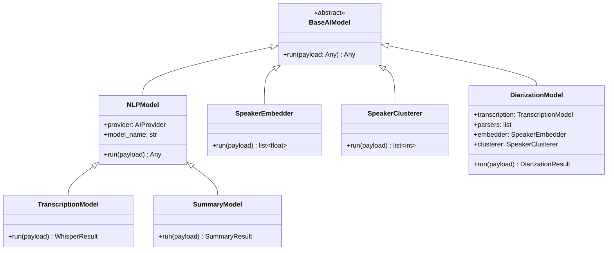
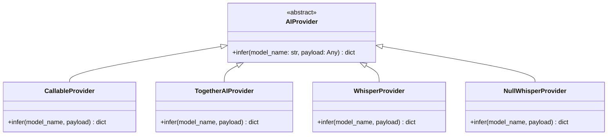
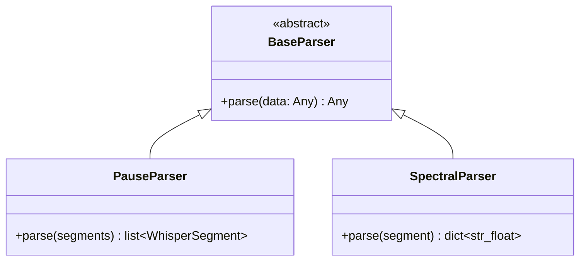
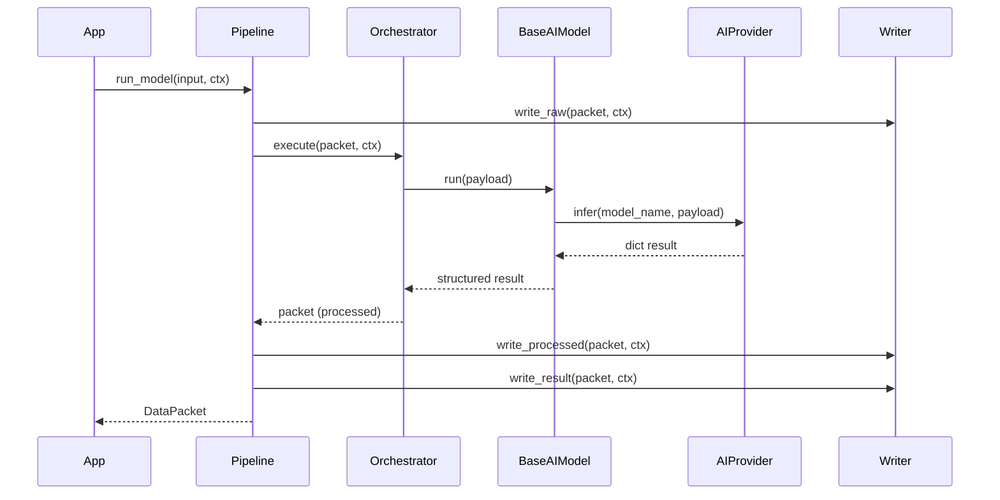

# Refactoring AI: gerarchia modelli, provider e persistenza

## Stato attuale

Il modulo `ai/` ha una struttura piatta con classi eterogenee:

- `**BaseAIModel**` (ABC) e `**NLPModel**` seguono gia il pattern model+provider corretto
- Le classi audio (`DiarizationPipeline`, `OpenAISpeechTranscriber`, `SummaryGenerator`) sono standalone e non estendono `BaseAIModel`
- `PauseDetector` e `SpectralAnalyzer` sono utility di trasformazione dati, non modelli
- `SpeakerEmbedder` e `SpeakerClusterer` eseguono operazioni ML-like ma non sono modelli
- `AIProvider` e concrete ma usa un pattern a callable injection (`infer_fn`) anziche override

```
ai/
├── base.py              # BaseAIModel
├── provider.py           # AIProvider (concrete, infer_fn)
├── nlp/model.py          # NLPModel(BaseAIModel)
├── providers/together.py # TogetherAIProvider(AIProvider)
├── audio/
│   ├── transcription.py  # OpenAISpeechTranscriber (standalone)
│   ├── diarization.py    # DiarizationPipeline + PauseDetector + SpectralAnalyzer + Embedder + Clusterer
│   └── summary.py        # SummaryGenerator (standalone)
├── cv/                   # vuoto
└── tabular/              # vuoto
```

## Struttura target

```
ai/
├── __init__.py           # re-export pubblici + alias deprecation
├── models/
│   ├── __init__.py
│   ├── base.py           # BaseAIModel (da ai/base.py)
│   ├── nlp.py            # NLPModel(BaseAIModel)
│   ├── transcription.py  # TranscriptionModel(NLPModel) + WhisperSegment, WhisperResult, SpeechTranscriber Protocol
│   ├── summary.py        # SummaryModel(NLPModel) + SummaryResult
│   ├── embedder.py       # SpeakerEmbedder(BaseAIModel)
│   ├── clusterer.py      # SpeakerClusterer(BaseAIModel)
│   └── diarization.py    # DiarizationModel(BaseAIModel) + DiarizedSegment, DiarizationResult
├── providers/
│   ├── __init__.py
│   ├── base.py           # AIProvider (ABC, abstract infer)
│   ├── callable.py       # CallableProvider(AIProvider) per backward compat infer_fn
│   ├── together.py       # TogetherAIProvider(AIProvider)
│   └── whisper.py        # WhisperProvider(AIProvider) + NullWhisperProvider
├── parsers/
│   ├── __init__.py
│   ├── base.py           # BaseParser (ABC)
│   ├── pause.py          # PauseParser(BaseParser) (da PauseDetector)
│   └── spectral.py       # SpectralParser(BaseParser) (da SpectralAnalyzer)
├── cv/                   # vuoto (placeholder futuro)
└── tabular/              # vuoto (placeholder futuro)
```

## Gerarchia classi










## Dettaglio per componente

### 1. `ai/providers/base.py` -- AIProvider diventa ABC

`AIProvider` passa da concrete con callable injection a ABC con `infer()` abstract:

```python
class AIProvider(ABC):
    @abstractmethod
    def infer(self, model_name: str, payload: Any) -> dict[str, Any]:
        ...
```

La vecchia signature `AIProvider(infer_fn=...)` viene preservata tramite `CallableProvider`:

```python
class CallableProvider(AIProvider):
    def __init__(self, infer_fn: Callable | None = None) -> None:
        self._infer = infer_fn or self._default_infer

    def infer(self, model_name: str, payload: Any) -> dict[str, Any]:
        result = self._infer(model_name, payload)
        return result if isinstance(result, dict) else {"result": result}
```

### 2. `ai/providers/whisper.py` -- WhisperProvider

Estrae la logica di transcription da `OpenAISpeechTranscriber` nel provider:

```python
class WhisperProvider(AIProvider):
    def __init__(self, client: Any, model: str = "whisper-1") -> None: ...
    def infer(self, model_name: str, payload: Any) -> dict[str, Any]:
        # payload = {"audio_path": ..., "language": ..., "response_format": ...}
        # Gestisce file singolo e chunked (>25MiB)
        # Ritorna {"text": ..., "segments": [...]}

class NullWhisperProvider(AIProvider):
    def infer(self, model_name: str, payload: Any) -> dict[str, Any]:
        return {"text": "", "segments": []}
```

### 3. `ai/models/transcription.py` -- TranscriptionModel

```python
class TranscriptionModel(NLPModel):
    def run(self, payload: Any) -> WhisperResult:
        raw = self._provider.infer(self._model_name, payload)
        return WhisperResult(
            text=raw["text"],
            segments=[WhisperSegment(**s) for s in raw["segments"]],
        )
```

I dataclass `WhisperSegment`, `WhisperResult` e il Protocol `SpeechTranscriber` rimangono in questo file.

### 4. `ai/models/summary.py` -- SummaryModel

```python
class SummaryModel(NLPModel):
    def run(self, payload: Any) -> SummaryResult:
        # payload = {"segments": [...], "context": {...}}
        # Logica provider + fallback come SummaryGenerator attuale
```

### 5. `ai/models/embedder.py` e `clusterer.py`

```python
class SpeakerEmbedder(BaseAIModel):
    def run(self, payload: Any) -> list[float]:
        # payload = {"duration": ..., "tokens": ..., "chars": ..., "rate": ...}
        # Stessa logica attuale di embed()

class SpeakerClusterer(BaseAIModel):
    def run(self, payload: Any) -> list[int]:
        # payload = {"vectors": [...], "num_speakers": N}
        # Stessa logica attuale di cluster()
```

### 6. `ai/models/diarization.py` -- DiarizationModel

Compone modelli e parser, unificando il `run()`:

```python
class DiarizationModel(BaseAIModel):
    def __init__(
        self,
        transcription: TranscriptionModel | None = None,
        pause_parser: PauseParser | None = None,
        spectral_parser: SpectralParser | None = None,
        embedder: SpeakerEmbedder | None = None,
        clusterer: SpeakerClusterer | None = None,
    ) -> None: ...

    def run(self, payload: Any) -> DiarizationResult:
        # payload = {"audio_path": ..., "num_speakers": 2, "language": None}
        # 1. transcription.run({"audio_path": ..., "language": ...}) -> WhisperResult
        # 2. pause_parser.parse(segments)
        # 3. spectral_parser.parse(seg) per ogni segmento
        # 4. embedder.run(features) per ogni segmento
        # 5. clusterer.run({"vectors": ..., "num_speakers": ...})
        # 6. Costruisce DiarizationResult
```

### 7. `ai/parsers/` -- PauseParser e SpectralParser

```python
class BaseParser(ABC):
    @abstractmethod
    def parse(self, data: Any) -> Any: ...

class PauseParser(BaseParser):
    def __init__(self, silence_gap_seconds: float = 1.5) -> None: ...
    def parse(self, data: list[WhisperSegment]) -> list[WhisperSegment]:
        # Stessa logica di PauseDetector.split()

class SpectralParser(BaseParser):
    def parse(self, data: WhisperSegment) -> dict[str, float]:
        # Stessa logica di SpectralAnalyzer.extract()
```

## Persistenza: opzione A (confermata)

Il codice attuale segue gia l'opzione A:

- `BaseAIModel.run()` restituisce solo il risultato, nessun side effect
- `Pipeline.run_model()` gestisce la persistenza tramite `Writer.write_raw()`, `write_processed()`, `write_result()`
- `Pipeline.run_crud()` e un flusso separato per operazioni CRUD su database

Formalizziamo questa scelta:

- **Regola**: nessun modello AI scrive su storage/S3 nel proprio `run()`. Il modello produce solo l'artefatto.
- **Se servono artefatti su S3**: il layer `Pipeline` o un `ArtifactWriter` dedicato li gestisce dopo `run()`.
- Documentare esplicitamente in `docs/architecture.md` e `docs/api-reference.md`.

## Flusso end-to-end (invariato)




## Backward compatibility

Ogni vecchio import path continua a funzionare con `DeprecationWarning`:


| Vecchio path                                     | Nuovo path                                           | Alias                    |
| ------------------------------------------------ | ---------------------------------------------------- | ------------------------ |
| `from ianuacare.ai.base import BaseAIModel`      | `from ianuacare.ai.models.base import BaseAIModel`   | module-level deprecation |
| `from ianuacare.ai.provider import AIProvider`   | `from ianuacare.ai.providers.base import AIProvider` | module-level deprecation |
| `from ianuacare.ai.nlp.model import NLPModel`    | `from ianuacare.ai.models.nlp import NLPModel`       | module-level deprecation |
| `AIProvider(infer_fn=...)`                       | `CallableProvider(infer_fn=...)`                     | constructor warning      |
| `DiarizationPipeline`                            | `DiarizationModel`                                   | alias in `__init__`      |
| `SummaryGenerator`                               | `SummaryModel`                                       | alias in `__init__`      |
| `OpenAISpeechTranscriber` / `WhisperTranscriber` | `TranscriptionModel` + `WhisperProvider`             | aliases + warning        |
| `PauseDetector`                                  | `PauseParser`                                        | alias                    |
| `SpectralAnalyzer`                               | `SpectralParser`                                     | alias                    |


I vecchi moduli (`ai/base.py`, `ai/provider.py`, `ai/nlp/`) vengono mantenuti come shim che ri-esportano dai nuovi path con warning. I vecchi nomi di classe vengono mantenuti come alias nel `__init__.py` del rispettivo pacchetto.

## Impatto sui test

- `tests/conftest.py`: fixture `provider` passa da `AIProvider()` a `CallableProvider()` (o `AIProvider` shim con warning)
- `tests/unit/test_ai.py`: aggiornare import, `StubModel` resta valido
- `tests/unit/test_audio_pipeline.py`: aggiornare ai nuovi nomi (`DiarizationModel`, `SummaryModel`, `PauseParser`, `SpectralParser`), aggiornare mock del `SpeechTranscriber` con `TranscriptionModel` o `WhisperProvider`
- `tests/unit/test_together.py`: `TogetherAIProvider` override diretto di `infer()` (rimuovere `_infer_impl`)
- Test pipeline/orchestrator: nessun impatto (usano solo `BaseAIModel.run()`)

## Impatto sulla documentazione

- `docs/api-reference.md`: sezioni AI e Audio da riscrivere con nuova gerarchia
- `docs/architecture.md`: aggiornare diagramma moduli e flusso, documentare persistenza opzione A
- `docs/audio-diarization.md`: aggiornare import e nomi classi, menzionare deprecation
- `docs/extending.md`: aggiornare esempi custom model, provider, parser
- `docs/getting-started.md`: aggiornare import e snippet minimali
- `docs/preconfigurations.md`: aggiornare snippet TogetherAIProvider

