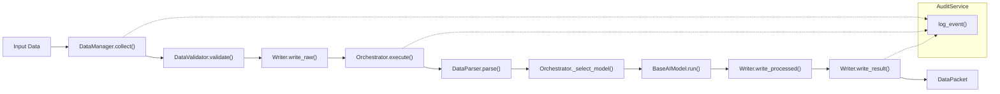

# Architecture

## Design overview

Ianuacare follows the **pipeline** pattern: a single `DataPacket` instance flows through **collect → validate → persist raw → orchestrate (parse + model) → persist processed → persist result**, with **audit** events at key stages.



## Layering (3 layers)

| Layer | Responsibility | Main modules |
|-------|----------------|--------------|
| **Core** | Domain models, business flow, errors, auth, orchestration and pipeline logic. | `ianuacare.core.models`, `ianuacare.core.pipeline`, `ianuacare.core.orchestration`, `ianuacare.core.auth`, `ianuacare.core.audit`, `ianuacare.core.config`, `ianuacare.core.logging`, `ianuacare.core.exceptions` |
| **AI** | AI abstractions and AI area packages. | `ianuacare.ai.base`, `ianuacare.ai.provider`, `ianuacare.ai.providers`, `ianuacare.ai.nlp`, `ianuacare.ai.cv`, `ianuacare.ai.tabular` |
| **Infrastructure** | External adapters and persistence implementations. | `ianuacare.infrastructure.storage`, `ianuacare.infrastructure.auth`, `ianuacare.infrastructure.cache`, `ianuacare.infrastructure.encryption` |

## Package structure

```text
src/ianuacare/
  core/
  ai/
    providers/
    nlp/
    cv/
    tabular/
  infrastructure/
    auth/
    cache/
    encryption/
    storage/
  presets/
```

## Relationships (from the class diagram)

- **Composition**: `Pipeline` holds `DataManager`, `DataValidator`, `Writer`, `Orchestrator`, `AuditService`. `Writer` holds `DatabaseClient`, `BucketClient`, optional `EncryptionService`. `Orchestrator` holds `DataParser`, a `dict[str, BaseAIModel]`, optional `CacheClient`. `AuthService` holds `UserRepository`. `CognitoLoginService` composes `CognitoPasswordAuthenticator` (infrastructure) to perform `USER_PASSWORD_AUTH`, then callers typically pass the access token to `AuthService` with `CognitoUserRepository`. `NLPModel` holds `AIProvider`.
- **Dependency**: most services accept `DataPacket` and `RequestContext` per call (no long-lived coupling).
- **Inheritance**: `NLPModel` extends `BaseAIModel`; concrete errors extend `IanuacareError`.

## Healthcare considerations

- **No PHI in audit `details`**: pass only structured identifiers; never patient names, diagnoses, or free text in audit records used for operations.
- **Encryption**: this library does not encrypt payloads; use application-layer or database encryption for regulated data.
- **Authorization**: `AuthService.authorize()` is explicit; wire it in HTTP/API layers before calling `Pipeline.run()`.

## In-memory implementations

`InMemoryDatabaseClient` and `InMemoryBucketClient` are provided for **tests and local development**. Production code should use adapters that talk to PostgreSQL, object storage, etc., implementing the same protocols.
