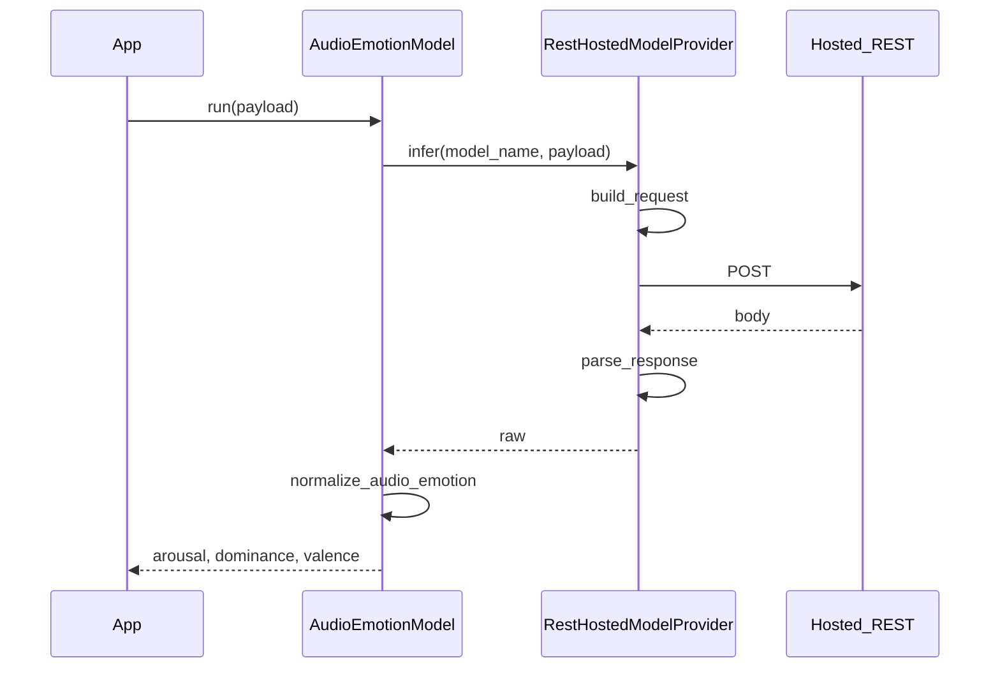

# Audio emotion (REST-hosted models)

This page documents dimensional speech emotion recognition (arousal, dominance, valence) via a **hosted REST endpoint** — for example a [Hugging Face Inference Endpoint](https://huggingface.co/docs/inference-endpoints/index) serving [audeering/wav2vec2-large-robust-12-ft-emotion-msp-dim](https://huggingface.co/audeering/wav2vec2-large-robust-12-ft-emotion-msp-dim).

## Modules

- `ianuacare.ai.providers` — `RestHostedModelProvider`, `RestRequest`
- `ianuacare.ai.models.inference` — `AudioEmotionModel`
- `ianuacare.ai.models.normalizer` — `ModelOutNormalizer.normalize_audio_emotion`

No extra pip dependency is required for the HTTP client (stdlib `urllib`); your endpoint contract is defined by injectable hooks.

!!! warning "Model license"
    The audeering model is **CC-BY-NC-SA-4.0** (research use). Verify licensing before production use; a commercial license is available from audEERING.

## Pattern

Same two-layer pattern as transcription and LLM:

1. **`RestHostedModelProvider.infer`** — builds the HTTP request (`build_request`), POSTs, parses the response (`parse_response`).
2. **`AudioEmotionModel.run`** — calls `provider.infer(model_name, payload)` and normalizes ADV scores.



## Wiring example

```python
import json
import os

from ianuacare import (
    AudioEmotionModel,
    InferenceError,
    ModelOutNormalizer,
    RestHostedModelProvider,
    RestRequest,
)

def build_request(model_name: str, payload: dict) -> RestRequest:
    audio_path = payload["audio_path"]
    with open(audio_path, "rb") as f:
        body = f.read()
    return RestRequest(
        url=os.environ.get("EMOTION_ENDPOINT_URL"),
        headers={
            "Content-Type": "audio/wav",
            "X-Model": model_name,
        },
        body=body,
    )

def parse_response(status: int, body: bytes, *, headers) -> object:
    _ = headers
    if status >= 400:
        raise InferenceError(f"emotion endpoint returned status {status}")
    return json.loads(body.decode("utf-8"))

provider = RestHostedModelProvider(
    endpoint_url=os.environ["EMOTION_ENDPOINT_URL"],
    api_key=os.environ.get("HF_TOKEN"),
    build_request=build_request,
    parse_response=parse_response,
)

emotion = AudioEmotionModel(
    provider,
    "audeering/wav2vec2-large-robust-12-ft-emotion-msp-dim",
    ModelOutNormalizer(),
)

models = {
    # ...
    "audio_emotion": emotion,
}
```

Register with `Orchestrator` and call via `RequestContext(metadata={"model_key": "audio_emotion"})`.

## Payload

| Field | Required | Description |
|-------|----------|-------------|
| `audio_path` | Yes | Path to a readable audio file on disk (same convention as diarization) |

Optional fields (for example `segment` with `start`/`end`) are not interpreted by the library in v1; your `build_request` hook may use them if the endpoint supports windowed inference.

## Output

`AudioEmotionModel.run` returns:

```python
{"arousal": 0.54, "dominance": 0.61, "valence": 0.40}
```

`ModelOutNormalizer.normalize_audio_emotion` accepts common REST shapes:

| Raw response | Normalized |
|--------------|------------|
| `[[a, d, v]]` or `[a, d, v]` | dict with three floats |
| `{"arousal": ..., "dominance": ..., "valence": ...}` | same keys, coerced to float |
| `[{"label": "arousal", "score": ...}, ...]` | mapped by label (case-insensitive) |

Unrecognized formats raise `InferenceError`.

## `RestHostedModelProvider` hooks

| Hook | Role |
|------|------|
| `build_request(model_name, payload) -> RestRequest` | Build URL override, headers, body bytes, HTTP method (default `POST`) |
| `parse_response(status, body, *, headers) -> Any` | Turn HTTP response into provider raw output; default parses JSON and raises on non-2xx |
| `post_fn(request, *, timeout_seconds)` | Optional transport (tests or custom client); default uses `urllib` |

If `api_key` is set and `Authorization` is not already in headers, the provider adds `Bearer {api_key}`.

## Pipeline example

```python
context = RequestContext(
    user=user,
    product="my-product",
    metadata={"model_key": "audio_emotion"},
)
packet = pipeline.run_model(
    {"audio_path": "/path/to/session.wav"},
    context,
)
print(packet.inference_result)
# {"arousal": 0.54, "dominance": 0.61, "valence": 0.40}
```

## Tests and local stubs

Use `CallableProvider` or a custom `post_fn` on `RestHostedModelProvider` to avoid network calls in unit tests. See `tests/unit/test_rest_hosted_provider.py` and `tests/unit/test_audio_emotion.py`.

For more extension points, see [Extending](extending.md).
