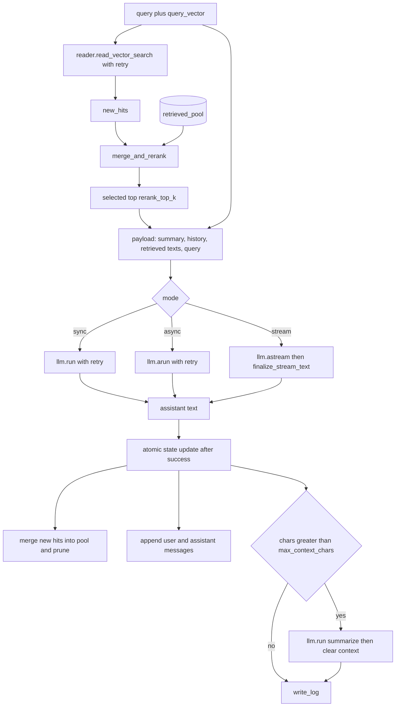

# RAG Chatbot (`ianuacare.core.chatbot`)

Optional orchestration for **retrieval-augmented** chat: vector search via `Reader`, generation via `LLMModel`, persistence of a **non-sensitive** audit line via `Writer.write_log`, and **session state** (role-based history, rolling summary, pooled vector hits with cross-turn reranking).

Chatbot types are **not** re-exported from the top-level `ianuacare` package. Import explicitly:

```python
from ianuacare.core.chatbot import Chatbot, Message
from ianuacare.core.chatbot.message import RetrievedPoint
from ianuacare.core.chatbot.chatbot import ConversationState
```

## Responsibilities

| Concern | Implementation |
|---------|----------------|
| Retrieval | `Reader.read_vector_search` (`filters.level` required: `text`, `sentence`, or `words`) |
| Ranking across turns | Merge **new hits** with `ConversationState.retrieved_pool`, dedupe by point `id`, apply **score decay** on older-only hits, keep top `rerank_top_k` |
| Conversation | `ConversationState.context` as `list[Message]` (`user` / `assistant` / optional `system`), optional rolling `summary` when character budget is exceeded |
| Latency / resilience | Retries with exponential backoff on retrieval and LLM (`ValidationError` is **not** retried) |
| APIs | Sync `inference`, async `ainference`, async token stream `astream` |

## Flow (one turn)



## Constructor parameters (`Chatbot`)

| Parameter | Role |
|-----------|------|
| `reader`, `writer`, `llm` | Injected dependencies |
| `collection`, `filters` | Passed to `read_vector_search` |
| `top_k`, `score_threshold` | Vector search breadth and cutoff |
| `rerank_top_k`, `score_decay`, `pool_max_size` | Cross-turn ranking and pool cap |
| `max_context_chars`, `system_prompt` | Budget and optional initial `system` message |
| `max_retries`, `retry_base_delay` | Retry policy |

## LLM payload shape

Each turn builds a dict (passed to `LLMModel.run` / `arun` / streaming):

- `summary`: rolling text after compression
- `history`: `[{"role", "content"}, ...]` from `ConversationState.context`
- `retrieved`: list of **source strings** from reranked `RetrievedPoint`s
- `query`: current user text

Extend your provider / prompts in the application layer if you need a fixed system instruction beyond `system_prompt`.

## Streaming and async defaults

`AIProvider` exposes default `infer_stream`, `ainfer`, and `ainfer_stream` built on `infer`. `LLMModel` adds `stream`, `arun`, `astream`, and `finalize_stream_text` so streaming can normalize the assembled text like `run`.

## Healthcare / logging

`Writer.write_log` **must not contain PHI**. The default implementation logs only structured metadata (event name, turn index, character lengths—not raw user or assistant content). If you replace logging with full transcripts, enforce encryption and policy in your application.

## Related

- [API reference — Chatbot](api-reference.md#chatbot-ianuacarecorechatbot)
- [Storage — Reader / Writer](api-reference.md#storage)
- [AI — LLMModel / AIProvider](api-reference.md#ai)
