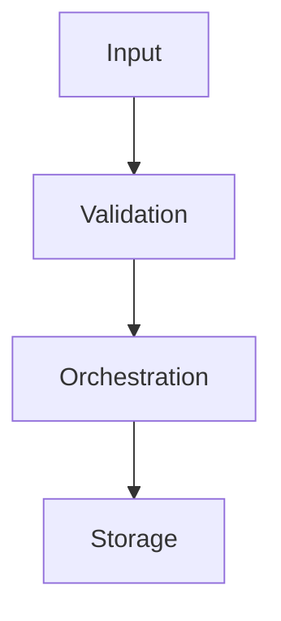

# Documentation workflow (MkDocs Material)

This project uses **MkDocs** with **Material for MkDocs** to keep technical documentation aligned with code changes.

## Goal

Keep docs updated every time the library changes (new modules, renamed packages, changed APIs, new examples, behavior changes).

## Non-negotiable rule

Documentation updates are **mandatory for every feature, refactor, or bugfix** that changes behavior, API, architecture, or setup.

- A feature is not complete until docs are updated.
- If no documentation file changes, the PR description must explicitly explain why docs are not impacted.

## What to update when code changes

For each relevant code change, update one or more pages in `docs/`:

- `docs/api-reference.md` for public classes, functions, and method signatures.
- `docs/architecture.md` for package structure, boundaries, and data flow.
- `docs/extending.md` for extension points and custom integrations.
- `docs/getting-started.md` for installation or usage changes.

If the change is broad, also update `docs/index.md` to reflect new documentation pages.

## Required documentation checklist

Before closing a feature/refactor/bugfix, verify:

- Public API changes are documented.
- Imports/module paths are correct and match current package layout.
- At least one usage example is still valid.
- Deprecated or removed behavior is explicitly called out.
- New external services/integrations are listed in `docs/preconfigurations.md` with clear naming and icons.

## Service icons convention

When documenting integrations, use MkDocs Material icon shortcodes for fast visual scanning.

Examples:

- `:simple-postgresql:` PostgreSQL
- `:fontawesome-brands-aws:` AWS services (Cognito, S3, KMS)
- `:simple-redis:` Redis
- `:material-robot-outline:` AI providers

Prefer stable, recognizable icons and keep the label text next to the icon for readability.

## Build and verify locally

From repository root, install the **`docs`** extra (pins MkDocs Material with the project):

```bash
pip install -e ".[docs]"
```

Or install only the theme:

```bash
pip install mkdocs-material
```

Start local docs server:

```bash
mkdocs serve
```

Or generate static docs (use **`--strict`** so warnings fail the build, same as CI should):

```bash
mkdocs build --strict
```

## `mkdocs.yml` and navigation

- Site config lives at **repository root**: `mkdocs.yml`.
- Markdown sources live in **`docs/`**; the **nav** order and page titles are defined under `nav:` in `mkdocs.yml`.
- When you add a new page, create `docs/<name>.md` and add an entry under `nav:` (and link it from `docs/index.md` if it is a major topic).

## Flowchart in documentation

Flowcharts are renderable directly in Markdown pages via Mermaid:



## Cursor workspace rule

The same requirement is reinforced for agents via:

- `.cursor/rules/mkdocs-documentation.mdc`

Any change under `src/ianuacare/` that affects public API or documented behavior should include the corresponding `docs/` updates in the **same change set**, and `mkdocs build --strict` should pass.
