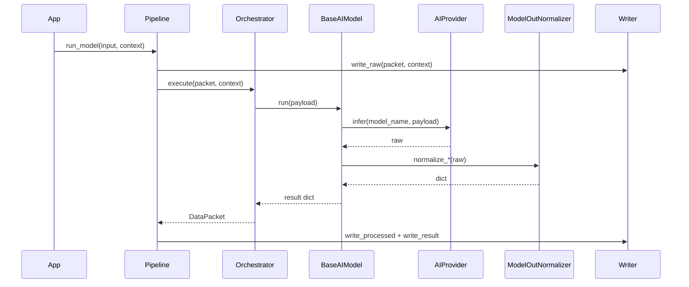

# Getting started

## Requirements

- Python **3.12+**

## Install

From the repository root:

```bash
pip install -e ".[dev]"
```

### Optional: AWS (Cognito, S3, …)

```bash
pip install -e ".[dev,aws]"
```

### Optional: Qdrant vector search

```bash
pip install -e ".[dev,qdrant]"
```

## Minimal example

```python
from ianuacare import (
    CallableProvider,
    AuditService,
    DataManager,
    DataValidator,
    InMemoryBucketClient,
    InMemoryDatabaseClient,
    InputDataParser,
    NLPModel,
    Orchestrator,
    OutputDataParser,
    Pipeline,
    Reader,
    RequestContext,
    User,
    Writer,
)

db = InMemoryDatabaseClient()
bucket = InMemoryBucketClient()
writer = Writer(db, bucket)
reader = Reader(db)
provider = CallableProvider()
nlp = NLPModel(provider, "clinical-nlp-v1")

pipe = Pipeline(
    data_manager=DataManager(),
    validator=DataValidator(),
    writer=writer,
    reader=reader,
    orchestrator=Orchestrator(
        InputDataParser(),
        OutputDataParser(),
        {"nlp": nlp},
        default_model_key="nlp",
    ),
    audit_service=AuditService(db),
)

ctx = RequestContext(
    User("u1", "clinician", ["pipeline:run"]),
    "my-product",
    metadata={"model_key": "nlp"},
)
packet = pipe.run({"text": "example input"}, ctx)
print(packet.inference_result)
```

## CRUD flow example

`Pipeline.run_crud(...)` executes CRUD operations through storage adapters:

```python
from ianuacare import (
    AuditService,
    DataManager,
    DataValidator,
    InMemoryBucketClient,
    InMemoryDatabaseClient,
    InputDataParser,
    Orchestrator,
    OutputDataParser,
    Pipeline,
    Reader,
    RequestContext,
    User,
    Writer,
)
from ianuacare.ai.models.inference.base import BaseAIModel


class NoOpModel(BaseAIModel):
    def run(self, payload: object) -> dict:
        return {"ok": True}


db = InMemoryDatabaseClient()
writer = Writer(db, InMemoryBucketClient())
reader = Reader(db)
pipe = Pipeline(
    DataManager(),
    DataValidator(),
    writer,
    reader,
    Orchestrator(
        InputDataParser(),
        OutputDataParser(),
        {"noop": NoOpModel()},
        default_model_key="noop",
    ),
    AuditService(db),
)
ctx = RequestContext(User("u1", "operator", ["patients:create"]), "clinic-app")

created = pipe.run_crud(
    "create",
    {
        "collection": "patients",
        "record": {"patient_id": "p-1001", "first_name": "Mario", "last_name": "Rossi"},
    },
    ctx,
)
print(created.processed_data)
```

## Vector flow example (`run_vector`)

`Pipeline.run_vector(...)` supports `upsert`, `search`, `delete`, and `scroll` (list all points in a collection, using the vector backend's scroll semantics; with Qdrant this maps to `QdrantClient.scroll` in pages).

```python
from ianuacare import InMemoryVectorDatabaseClient, TextEmbedder

vector_db = InMemoryVectorDatabaseClient()
writer = Writer(db, InMemoryBucketClient(), vector_client=vector_db)
reader = Reader(db, vector_client=vector_db)
embedder = TextEmbedder(provider=CallableProvider(lambda _, batch: [[1.0, 0.0] for _ in batch]))

pipe = Pipeline(
    DataManager(),
    DataValidator(),
    writer,
    reader,
    Orchestrator(
        InputDataParser(),
        OutputDataParser(),
        {"text_embedder": embedder},
        default_model_key="text_embedder",
    ),
    AuditService(db),
)

# upsert one artefact at text level
pipe.run_vector(
    "upsert",
    {
        "collection": "clinical_notes",
        "vector_field": "text",
        "artefatti": [{
            "id_artefatto_trascrizione": "tr-1",
            "text": "diabete tipo 2",
            "text_vect": [1.0, 0.0],
            "sentence": [],
            "sentence_vect": [],
            "words": [],
            "words_vect": [],
        }],
    },
    ctx,
)

# search by prompt (embedded via Orchestrator.embed_text)
hits = pipe.run_vector(
    "search",
    {
        "collection": "clinical_notes",
        "prompt": "diabete",
        "top_k": 5,
        "filters": {"level": "text"},
    },
    ctx,
).processed_data
print(hits)
```

### Elencare tutti i punti (`scroll`)

Dopo un upsert (o per ispezionare una collection esistente), puoi ottenere l'elenco completo dei punti senza query vettoriale:

```python
points = pipe.run_vector(
    "scroll",
    {
        "collection": "clinical_notes",
        # opzionale: filtri esatti sul payload, es. {"level": "text"}
        # "batch_size": 256,       # dimensione pagina verso Qdrant
        # "with_vectors": True,   # includi i vettori in ogni punto
        # "with_payload": True,   # default
    },
    ctx,
).processed_data
print([p["id"] for p in points])
```

For `QdrantDatabaseClient`, `upsert(...)` auto-calls `ensure_collection(...)` when the collection is missing (distance default: `Cosine`).

### Cognito: password login + token authentication

With `boto3` installed (`[aws]`), you can obtain tokens and reuse `AuthService` with `CognitoUserRepository`:

```python
from ianuacare import AuthService, CognitoLoginService, CognitoUserRepository

login = CognitoLoginService(
    "eu-west-1",
    "your-app-client-id",
    client_secret=None,  # set if the app client has a secret
)
tokens = login.login("user@example.com", "password")

auth = AuthService(
    CognitoUserRepository(
        "eu-west-1",
        "your-user-pool-id",
        "your-app-client-id",
    )
)
user = auth.authenticate(tokens.access_token)
```

Do not log passwords or full tokens; treat `LoginTokens` as secrets in your app.

### Cognito: self-registration and confirmation

```python
from ianuacare import CognitoRegistrationService

reg = CognitoRegistrationService(
    "eu-west-1",
    "your-app-client-id",
    client_secret=None,
)
result = reg.register(
    "user@example.com",
    "ValidP@ssw0rd1",
    attributes={"email": "user@example.com"},
)
if not result.user_confirmed:
    reg.confirm("user@example.com", code_from_email)
```

Pool and app client must allow sign-up; do not log confirmation codes.

### Cognito: reset password, logout, change password, profile

```python
from ianuacare import CognitoAccountService, CognitoLoginService

account = CognitoAccountService("eu-west-1", "your-app-client-id")
delivery = account.request_password_reset("user@example.com")
# show delivery.destination / delivery.delivery_medium to the user (masked)
account.confirm_password_reset("user@example.com", "123456", "NewValidP@ss1")

tokens = CognitoLoginService("eu-west-1", "your-app-client-id").login(
    "user@example.com", "NewValidP@ss1"
)
account.change_password(tokens.access_token, "NewValidP@ss1", "AnotherValidP@ss2")
account.update_profile_attributes(tokens.access_token, {"given_name": "Ada"})
account.logout(tokens.access_token)
```

Do not log passwords, codes, or raw tokens.

## Run tests

```bash
pytest

# With coverage (matches CI expectations)
pytest --cov=ianuacare --cov-report=term-missing
```

## Lint and types

```bash
ruff check src tests
mypy src
```

## E2E model flow (example)



```python
from ianuacare import (
    CallableProvider,
    ModelOutNormalizer,
    NLPModel,
    Transcription,
)

provider = CallableProvider(lambda model, payload: {"text": "ok", "segments": []})
transcription = Transcription(provider, "asr", ModelOutNormalizer())
generic_nlp = NLPModel(provider, "nlp")
```

The persistence policy is explicit: model `run()` returns output only; writing is done by `Pipeline`/`Writer` (and CRUD stays in `run_crud`).

## Next steps

- Read [Audio transcription and diarization](audio-diarization.md) for reusable
  speech pipeline primitives under `ianuacare.ai.models.inference`.
- Read [API reference](api-reference.md) for class details.
- Read [Preconfigurations](preconfigurations.md) for production-ready adapters.
- Read [Extending](extending.md) to add custom models and validation.
